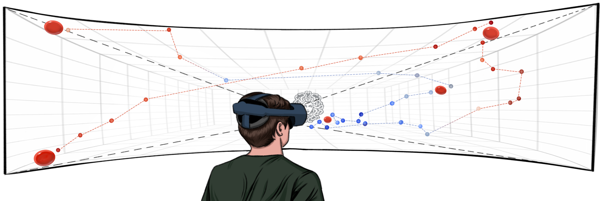

About me
======
I am Aochen Jiao, currently a research assistant at [City University of Hong Kong](https://www.cityu.edu.hk/), where I am supervised by Prof. [Weitao Xu](https://weitaoxu.com) and Prof. [Shengdong Zhao](https://shengdongzhao.com). Prior to that, I obtained my Master's degree from [UCLA](https://www.ucla.edu/) and Bachelor's degree from [Tongji University](https://en.tongji.edu.cn/p/#/). 

My research interests lie in the intersection of human-computer interaction, ubiquitous computing and AR/VR, with a particular focus on enhancing human natural interaction capabilities through innovative wearable technologies. Outside the lab, I enjoy Chinese calligraphy, traveling and watching soccer matches.

I am actively looking for Ph.D. position starting in Fall 2025. If you have any relative information please feel free to contact me!

Education
------
* M.S. in Electrical and Computer Engineering, UCLA, 2023.
* B.Eng. in Automation, Tongji University, 2021.

News
------
* [Jul. 2024] Join the [<i>HCI Research Summer Camp</i>](https://synteraction.org/news/conclusion-2024-chiang-mai-research-camp-.html) in Chiang Mai. Thrilled to meet many new interesting friends!
* [Jun. 2024] My first paper [<i>Medusa3D</i>](../files/Medusa3D.pdf) is accepted to [<i>MobileHCI'24</i>](https://mobilehci.acm.org/2024/). See you in Melbourne!

<!--

  <ul>
    <li><b>[Jun. 2024]</b> My first paper <i>Medusa3D</i> is accepted by <i>[MobileHCI'24](https://mobilehci.acm.org/2024/)</i>.</li>
  </ul>

-->

Publication
------
<html lang="en">
<head>
  <meta charset="UTF-8">
  <meta name="viewport" content="width=device-width, initial-scale=1.0">
</head>

<body>
  

    
    

      

        Medusa3D: The Watchful Eye Freezing Illegitimate Users in Virtual Reality Interactions 
        <strong>Aochen Jiao</strong>*, Di Duan*, and Weitao Xu (* <i>Equal contribution</i>) 
        <i>ACM MobileHCI 2024</i> <a href="../files/Medusa3D.pdf" class="button">PDF</a> <a href="https://doi.org/10.1145/3676515" class="button">DOI</a> <a class="button" onclick="showBibtex('bibtex-container-medusa3d')">Cite</a>
      

    

  

  

    <pre id="bibtex-entry-medusa3d" class="inline-code">
@article{jiao2024medusa3d,
  title={Medusa3D: The Watchful Eye Freezing Illegitimate Users in Virtual Reality Interactions},
  author={Jiao, Aochen and Duan, Di and Xu, Weitao},
  journal={Proceedings of the ACM on Human-Computer Interaction},
  volume={8},
  number={MHCI},
  pages={1--21},
  year={2024},
  doi={https://doi.org/10.1145/3676515},
  publisher={ACM New York, NY, USA}
}</pre>
    <a class="button" onclick="copyBibtex('bibtex-entry-medusa3d')">Copy</a>
  

  
</body>

</html>
